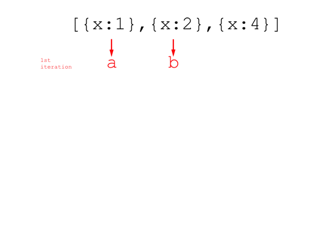

# Array `reduce()` method

`reduce()` is a method of the `Array` object. It returns a single value by applying a callback function, which is specified as the first parameter of the method, to each element of the array. This method is one of the functions called higher-order functions, which are shorter, more readable alternatives to iterating through an array with a loop.

## Example

Let's see one of the examples on [MDN](https://developer.mozilla.org/en-US/docs/Web/JavaScript/Reference/Global_Objects/Array/Reduce). Assume that you have an array `[0, 1, 2, 3, 4]` and you want to calculate the sum of all the elements of the array.

It is possible to loop through the array and calculate the sum as shown below:

```javascript
var numbers = [0, 1, 2, 3, 4];
var sum = 0;

for (var i = 0; i < numbers.length; i++) {
  sum += numbers[i];
}
console.log(sum);
// 10
```

However, by using the `reduce()` method, you can write the same calculation more concisely as shown below:

```javascript
var numbers = [0, 1, 2, 3, 4];
var sum = numbers.reduce(function(a, b) {
  return a + b;
});
console.log(sum);
// 10
```

## Callback function

In the example above, the callback function is an anonymous function. It takes two parameters, `a` and `b`, and returns the sum of `a` and `b`. **Understanding how these parameters work is critical if you want to use this method properly.**

Basically the callback function is called for each element of the array (and I call each invocation of the callback function an "iteration" in this tutorial).

In each iteration,

- The first parameter (`a`) stores the value returned by the callback function at the previous iteration
- The second parameter (`b`) stores the element value of the array at the current iteration

At the first iteration, no callback function has been executed, so the first parameter (`a`) stores the first element of the array (`0`), and the second parameter (`b`) stores the second element of the array (`1`).

The following diagram shows how the element values are assigned to the parameters:


As you can see, the element values are passed to the second parameter (`b`) one by one, and the first parameter (`a`) holds the previous result of the callback function. After you go though all the element values, the value of the first parameter (`a`) becomes the final result of the `reduce()` method.

## The second parameter of the `reduce()` method

In the example above, the value of the first element of the array is assigned to the first parameter at the first iteration. However, you can specify the initial value of the first parameter as an optional (second) parameter of the `reduce()` method as shown below (`10` is specified as the second parameter, which is used as the initial value of the first parameter (`a`)):

```javascript
var numbers = [0, 1, 2, 3, 4];
var sum = numbers.reduce(function(a, b) {
  return a + b;
}, 10);
console.log(sum);
// 20
```

At the first iteration of the callback function, the first parameter (`a`) stores the initial value (`10`). The second parameter (`b`) stores the first element of the array (`0`). Then the rest of the calculation is done in the same way as the first example.


If you understand how these parameters work, you can understand how to correct a mistake in the example below (taken from [Javascript reduce on array of objects – StackOverflow](http://stackoverflow.com/questions/5732043/javascript-reduce-on-array-of-objects))

Here you want to calculate the sum of the property `x` value of all the elements of the array `arr`. However, the following code does not work.

```javascript
var arr = [{x:1}, {x:2}, {x:4}];
arr.reduce(function(a,b){
  return a.x + b.x
});
// NaN
```

Why is it?

The problem is that the callback function returns a number, so at the next iteration, the parameter `a` holds a number. Then, the function accesses `a.x`, which is `undefined` because a number does not have a property called `x`, and `undefined + number` becomes `NaN`.


In order to fix the problem, you need to write a code like the following example, which returns a value as an object:

```javascript
var arr = [{x:1}, {x:2}, {x:4}];
arr.reduce(function (a, b) {
  return {x: a.x + b.x}; // returns object with property x
});
// {x: 7}
```



Alternatively, the following example returns a value as a number:

```javascript
var arr = [{x:1}, {x:2}, {x:4}];
arr.reduce(function (a, b) {
  return a + b.x; // returns a number
}, 0);
// 7
```

Note that you need to specify the initial value `0` as the second parameter of the `reduce()` method, because, as mentioned above, the initial value of the parameter `a` would be the first element of the array (`{x:1}` in this case) if the second parameter of the `reduce()` method were not specified.

Another example of the `reduce()` method is to count the occurence of values in an array. For example, the following example shows one of the ways to count how many times each letters appears in an array:

```javascript
var array = ['A', 'B', 'C', 'B', 'B', 'A', 'A', 'C', 'A', 'B'];
var counts = array.reduce(function(a, b){
  a[b] = (a[b] || 0) + 1;
  return a;
}, {});
console.log(counts);
// {A: 4, B: 4, C: 2}
```

Note that the initial value of the object `{}` is specified as the second parameter of the `reduce()` method. This object holds the letters and their counter values. At each iteration of the callback function, the counter is incremented by looking up the counter value (`a[b]`).

## Other parameters of the callback function

The `reduce()` method can actually take 2 more parameters:

- The third parameter stores the index value of the element at the current iteration
- The fourth parameter stores the array itself

The following is an example of converting an array of digits into a number by using these parameters. The original example was taken from [reduce Method (Array) (JavaScript) – MSDN](https://msdn.microsoft.com/en-us/library/ff679975.aspx):

```javascript
var digits = [4, 1, 2, 5];
var result = digits.reduce(function(p, c, i, arr){
  var exponent = (arr.length - 1) - i;
  var digitValue = c * Math.pow(10, exponent);
  return p + digitValue;
}, 0);
console.log(result);
// 4125
```

## Points to remember

- The `reduce()` method returns a single value.
- The first parameter of the `reduce()` method is a callback function.
- The result of the callback function is passed to the first parameter of the callback function at the next iteration.
- The initial value of the first parameter can be specified as the second parameter of the `reduce()` method.
- The elements of the array are passed to the second parameter of the callback function, one by one.

## Further reading

- [Array.prototype.reduce() – MDN](https://developer.mozilla.org/en-US/docs/Web/JavaScript/Reference/Global_Objects/Array/Reduce)
- [reduce Method (Array) (JavaScript) – MSDN](https://msdn.microsoft.com/en-us/library/ff679975.aspx)
- [Array.prototype.reduce in JavaScript by example – egghead.io](https://egghead.io/lessons/javascript-array-prototype-reduce-in-javascript-by-example)
- [From Map/Reduce to JavaScript Functional Programming](https://hacks.mozilla.org/2015/01/from-mapreduce-to-javascript-functional-programming/)
- [Eloquent Javascript Chapter 5 - Chapter 5 Higher-Order Functions](http://eloquentjavascript.net/05_higher_order.html)
- [Codecademy Advanced Array manipulation](https://www.codecademy.com/courses/javascript-advanced-en-eQcHT/0/1)


