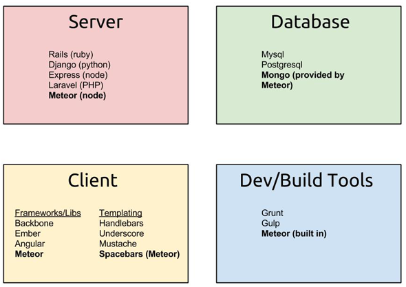
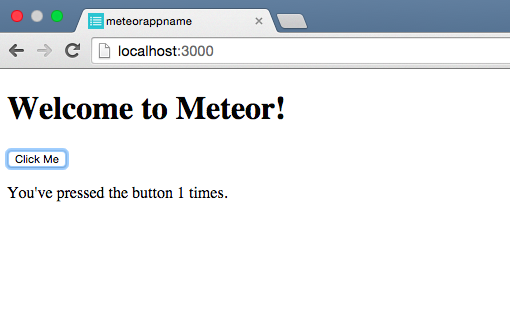
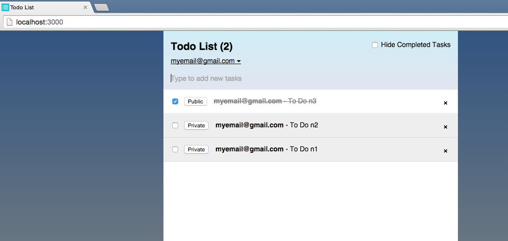

# Discover Meteor

### What is Meteor.js?
[Meteor](https://www.meteor.com/) is a platform for building web and mobile apps in pure JavaScript.

"Meteor.js is a cohesive development platform, a collection of libraries and packages that are bound together in a tidy way to make web development easier". [Josh Owens](http://joshowens.me/what-is-meteor-js/)

### How does Meteor work?

This is an image from [Matthew Platts](http://www.meteor-tutorial.org/book/overview) 

### Install Meteor
On OS X or Linux: 
Type in the terminal
```bash
$ curl https://install.meteor.com/ | sh
```
On OS X or Windows: 
[Install the official Meteor installer](https://install.meteor.com/windows)

### Create a Project

After having installed Meteor, let's create a project, in your terminal type:
```bash
$ meteor create the-name-of-your-app
```

Now you can run your app locally:
```bash
$ cd the-name-of-your-app
$ meteor
```
To see your project you can open a browser and go to [http://localhost:3000/](http://localhost:3000/)



### Tutorial 1 - Create your First Meteor App

In this [tutorial](http://meteortips.com/first-meteor-tutorial/projects/) you can create a Leaderboard application and understand how meteor work.
This is what you will build.
[This is what you will build.](http://leaderboard2.meteor.com/)


### Tutorial 2 - Create your Second Meteor App

In this [other tutorial](https://www.meteor.com/tutorials/blaze/creating-an-app) you can create a To Do app.
This is what you will build.


## Structuring your Meteor Application
Meteor doesn’t enforce a precise file structure. You have several option about how to structure a project, here are a few:

- [Iron - a command line scaffolding tool for Meteor applications. It automatically creates project structure, files and boilerplate code.](https://github.com/iron-meteor/iron-cli)
- [Meteor Boilerplate by Matteodem - This boilerplate gives you a starting point for your meteor projects](https://github.com/matteodem/meteor-boilerplate)
- [Void by Sacha Greif](https://github.com/SachaG/Void)
- [Documentation](http://docs.meteor.com/#/full/structuringyourapp)

## References and Additional Resources

Tutorials

- [Create your first meteor app](https://www.meteor.com/tutorials/blaze/creating-an-app)
- [An app made with meteor](https://tmc-011-demo.meteor.com/) - This app allows you order a pizza in a few minutes and you can also customize your own pizza. Here is a [tutorial for the Pizza app](https://themeteorchef.com/recipes/building-complex-forms/).
- [The Meteor Chef - In-depth tutorials that help you implement functionality in your Meteor application](https://themeteorchef.com/)

Books

- [Discover Meteor](https://www.discovermeteor.com/)

Online Courses & Videos

- [Coursera Course - Introduction to Meteor.js Development](https://www.coursera.org/learn/meteor-development?utm_campaign=Adoption%3A+Developer&utm_source=hs_automation&utm_medium=email&utm_content=22578294&_hsenc=p2ANqtz--5qcwXKvjh26WXEcIsUXaWI_48bvCHsmcZkmpzu0MG9iifmHQZvEEUpyJVfYuUGVeofpMlWpJzlVQf_RGbiJF5xEQjIw&_hsmi=22578515)
- [Meteor For Everyone Tutorials - Youtube Videos](https://www.youtube.com/playlist?list=PLLnpHn493BHECNl9I8gwos-hEfFrer7TV) 

