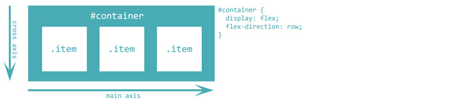
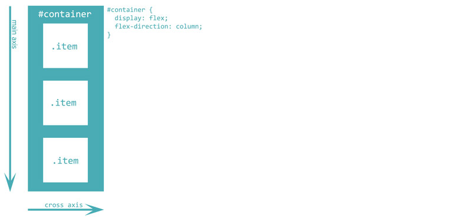
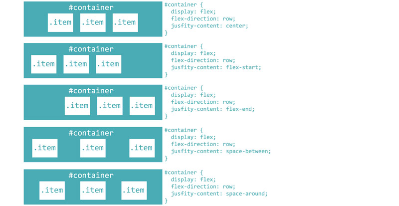
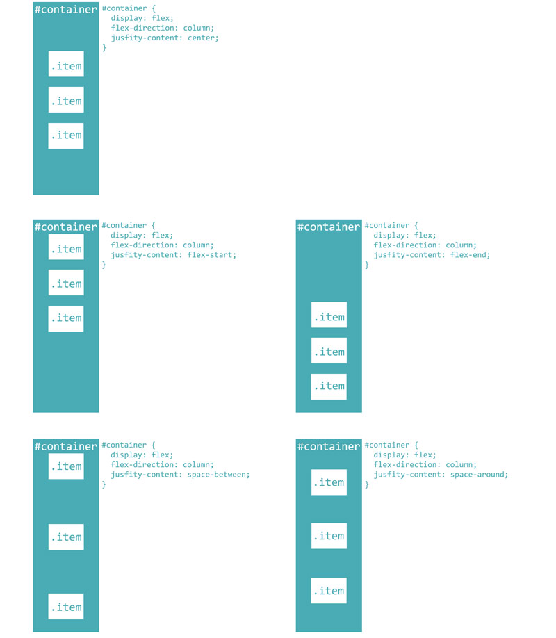
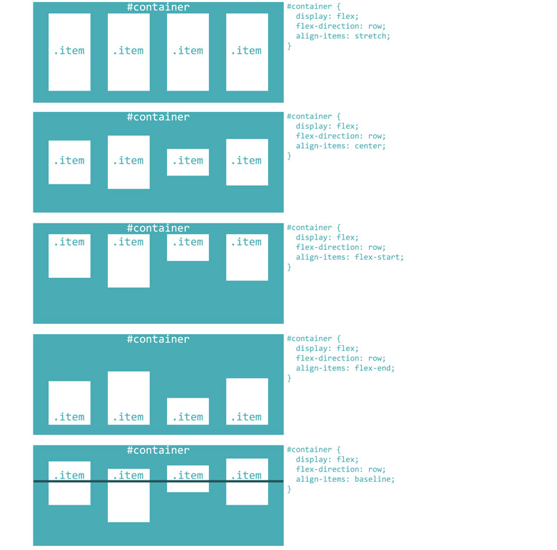

# Visual guide to laying out your content with the CSS flexbox

Introduction: Flexbox provides a very easy and efficient way to lay out, align and distribute content on your page - often with much less effort and sweat than with older methods (e.g. using floats). Flexbox is also highly suited for coding pages that will be displayed on various screen sizes.
In this article we will present the different ways that flexbox layout can be used to structure a page that displays well on different screen sizes and devices.

A flexbox can be thought of as an elastic container that holds its elements inside and responds to screen size changes by shuffling its contents about in a predictable way. We use CSS to control how the layout of our page elements will change when the viewing screen size is changed.

A flexbox layout is defined by adding the following CSS rule to the element containing the items that you wish to display flexibly. In the examples below, we have used an id tag, called "container", to identify the containing element, which holds three elements (or items) within it.

```css
#container {
  display: flex;
}
```

## Arranging items horizontally or vertically with flex-direction
The `flex-direction` property determines the direction of the **main axis** and **cross axis**, thus defining the direction in which the flex items are stacked. You can think of flex items wanting to arrange themselves either horizontally in a row, or vertically in a column.

In the example below, our *flexbox container* is turquoise and contains several *flex elements* which are displayed in white. These white boxes are called *flex elements* because they are confined to the turquoise *flex container*; and they will rearrange themselves inside the flex container as the screen size is changed and the flex container expands or contracts in response to the change.

The default behaviour is for flex elements to arrange themselves from left-to-right, or from top-to-bottom, depending on the specified direction of the main-axis. The main-axis is horizontal if you define it as such with `flex direction: row` or vertical if you define it as such with `flex direction: column`.

### Row layout
```css
#container {
    flex-direction: row;
}
```


### Column layout
```css
#container {
    flex-direction: column;
}
```


## Distributing content along the main axis with justify-content
By default, flex elements stack themselves one right next to another, from start to end along the main axis. The `justify-content` property allows us to more meaningfully distribute the flex items along the **main-axis**. Bear in mind that the main axis runs horizontally or vertically depending on the flex-direction you specify, so `justify-content` will distribute items horizontally in row layout, and vertically in column layout.

### justify-content (in row layout)


### justify-content (in column layout)


## Aligning content along the cross axis with align-items

### align-items (in row layout)


## Distributing content along one or multiple lines with flex-wrap

##flex-wrap
The `flex-wrap` property defines whether the flex items are forced in a single line or can be flowed into multiple lines. It also defines the cross-axis, which determines the direction the new lines are stacked in.

The `flex-wrap` property accepts 3 different values:

`flex-wrap:nowrap` – this is the default value where the flex items are forced in a single line and this may cause the container to overflow

`flex-wrap:wrap` – items are flowed into multiple lines and the direction of the lines is determined by the flex-direction (which takes a value of either row or column)

`flex-wrap:wrap–reverse` – items are flowed in multiple lines and the direction is opposite to the flex-direction(which takes a value of either row or column)
