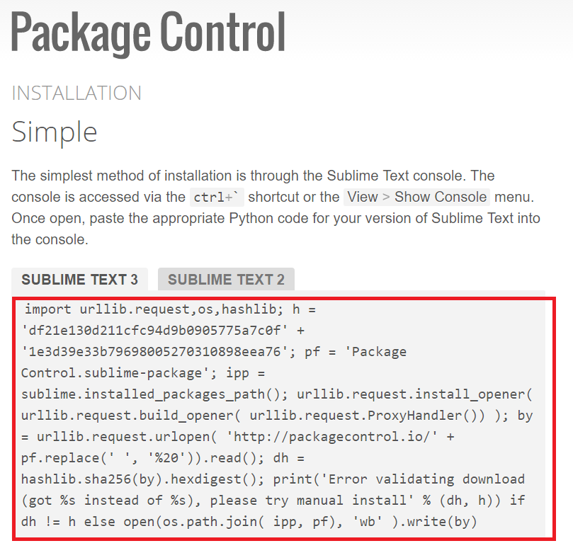

#Setting Up Your Development Environment

Taking the time to properly set up your text editor massively speeds up your workflow in the long-run. Do it!

##Sublime Text 3

###Download and Installation
Begin by downloading and installing Sublime [here](https://www.sublimetext.com/).

###Package Control
Package Control allows you to add custom features ("packages") to Sublime. 

To get started, install Package Control by copying the code listed [here](https://packagecontrol.io/installation).
The code to copy is shown in the red box, below.

Next, open Sublime. Select "View" --> "Show Console".

Paste the red-box code into the console and hit "Enter".

Once the installation is complete, close and re-open Sublime to allow it to update.

To test that the installation was succesful, open your Command Palette with CTRL-SHIFT-P (CMD-SHIFT-P) and begin typing "install package". You should see an option appear
called "Package Control: Install Package". Select this option to begin searching for and installing new packages!

###Packages

Packages are customizing add-on features for your text editor. There are tons of them available for Sublime! Remember that some packages come with their own READMEs that detail how to correctly install them.

* Colour scheme packages:
These alter the colours of your code. _Recommended:_ **Dayle Rees Colour Schemes**. This package includes many colour schemes that you can test out and pick your favourite one of.

* Themes:
These alter the entire aesthetic of your workspace, including things like the appearance of folder icons. _Recommended:_ **Predawn**.

* Bracket Highlighter:
This package visually matches any bracket with its partner bracket when you click on it. This is extremely useful when dealing with nested blocks of code! _Recommended:_ **BracketHighlighter**.

* JavaScript Autocompletion:
This package will provide suggestions while you're writing your JS code. Huge time-saver. _Recommended:_ **tern_for_sublime**

* HTML and CSS Autocompletion:
This package is called Emmet and will autofill (via either the Tab key, or CTRL+E) while you're writing HTML and CSS. For example, to get a basic skeleton for your HTML code, save your document as a ".html" file to let Emmet know that you're writing HTML code. Then simply type an exclamation mark, "!", followed by the Tab key afterward. Emmet will produce your whole HTML skeleton on cue - it's that easy!. _Recommended:_ **Emmet**

* Linter:
A linter automatically checks for typos and small errors in your lines of code. To use such a package, you first have to download and install [node.js](https://nodejs.org/en/). Now install the package, "SublimeLinter". This is a required first step, but you'll have to now install separate linters for JS, CSS and HTML.  Go to your Terminal (or Command Line / Bash in Windows) and type in "npm install -g jshint" and run that. If it doesn't work, try "sudo npm install -g jshint". You may be prompted for an administrator password. Details on that can be found [here](https://github.com/SublimeLinter/SublimeLinter-jshint). Now go back to your package installer in Sublime (remember: CTRL-SHIFT-P --> "Install Package") and type in "SublimeLinter-jshint". Install it.  A similar process can be followed for installing your CSS linter. Go [this page](https://github.com/SublimeLinter/SublimeLinter-csslint) and find the relevant line of code for your Terminal/Command Line/Bash- it should be "npm install -g csslint" (or with a "sudo" in front). Then install "SublimeLinter-csslint" from your Package Installer.  For your HTML, install [HTML Tidy](https://github.com/SublimeLinter/SublimeLinter-html-tidy).  Restart Sublime and you should have a linter for your code! If you make an error (e.g. forgetting a semi-colon in your code), a red dot should appear next to that line of code. Click on the line and at the bottom of your screen, the linter will display a brief message telling you what it believes to be wrong with your code.

###Removing packages that you no longer want

Quite easy: open your Command Palette (CTRL+SHIFT+P) and type "Package Control: Remove Package" and you will be able to remove any package that you currently have installed.

##Atom

##Brackets
