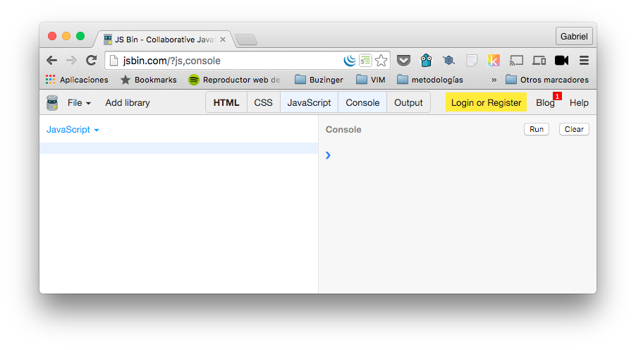
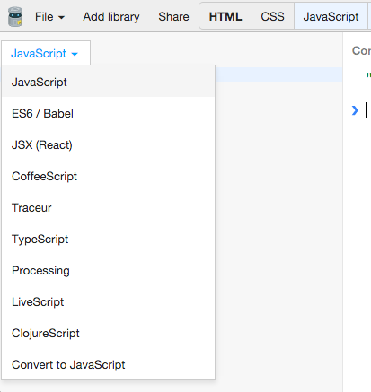
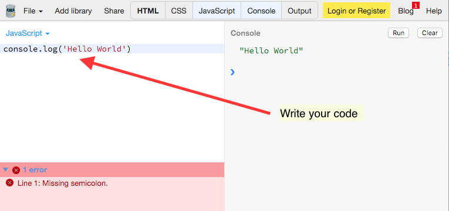
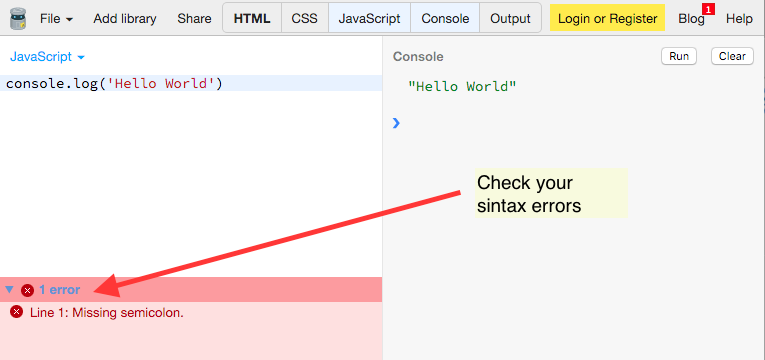
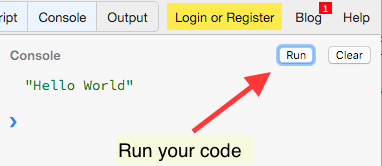

# Start to develop JavaScript

## A little bit of history

JavaScript, also known as ECMAScript is programming language created by
[Brendam Eich](https://en.wikipedia.org/wiki/Brendan_Eich) for the
Netscape browser in 1995. JavaScript was created to give some dynamism
to the static web pages of the late 90's. Now, many of the most important websites
are huge JavaScript applications. Some of them are Gmail,
Youtube, Netflix, Airbnb...

There are two main environments where JavaScript can be executed, browsers
like Internet Explorer, Chrome or Firefox and [Nodejs](https://nodejs.org),
which let you execute javascript in the command line or like a server language
in substitution of *php*, *java*, *ruby*, or others.

## Code Editors and IDEs
In order to start coding, we will need a tool to write our code within. These should should help us to be more productive writing code, avoid mistakes and highlight
our code while exposing our syntax errors.

In this README I'm going to talk about two main kinds of code editors:
- Online Code Editors
- Desktop Code Editors

### Online Code Editors

Sometimes, it's tricky to setup your environment to start developing small projects, or concept proofs. Maybe you only want to be able to
share a small snippet with other people. To accomplish those things we
have available some online code editors like [jsbin](https://jsbin.com),
[jsfiddle](https://jsfiddle.net/), or [codepen](http://codepen.io/).
There you can write your code and run it without leaving the browser.
There are too others tools with more features like
[cloud9](https://c9.io/), which allows you to run code from other
languages, or even run a web server in nodejs.


#### How to start with jsbin
- Open a browser and go to [http://jsbin.com](http://jsbin.com)

  

- Select panels you are going to need for your code

  

- Choose the language you are going to code with

  

- Write your code

  

- Check your syntax errors

  

- Fix your code

  

- Run your code

  

- And share it

  

### Desktop Code Editors

One of the first things you are going to need is a code editor. A code
editor is a tool like *the notepad* which allows you to write code, but
it comes with extra tools like code highlighting, autocompletion or small
snippets to avoid repeating some tasks.

Let's take a look at some of them:

- [Visual Studio Code](https://code.visualstudio.com/). This is a free
  open source code editor from MicroSoft. It has a lot of packages
  and plugins.
- [Atom](https://atom.io/). This is a free and open source code editor
  developed by GitHub.
  It has a lot of packages and plugins for everything you could need.
- [Brackets](http://brackets.io/). Another free and open source code
  editor developed by Adobe. It comes with Live Preview, which is a good
  feature for newbies, it allows you preview every change you made on
  your code files in the browser.
- [Sublime Text](https://www.sublimetext.com/). One of the most famous
  code editor. It has a bunch of packages and plugins. It isn't free,
  but you can download a trial version which is completly functional.

#### How to start with Brackets
I have selected Brackets to make this tutorial because I think built-in
live preview is cool tool for newbies, so it's going to be easier to start
making websites.

```html
<!DOCTYPE html>
<html>
  <head>
    <title>Our first website</title>
  </head>
  <body>
    <script>
    function wave(name){
      return 'Hello World, my name is ' + name;
    }

    alert(wave('Gabriel'));
    </script>
  </body>
</html>
```


```javascript
function wave(name){
  return 'Hello World, my name is ' + name;
}

alert(wave('Gabriel'));
```

```html
<!DOCTYPE html>
<html>
  <head>
    <title>Our first website</title>
  </head>
  <body>
    <script src="myscript.js"></script>
  </body>
</html>
```

## Code Linters

There are tools for reviewing your code, specifically looking for syntax error
and bad practices. The two most popular are:

- [jslint](http://www.jslint.com/)
- [jshint](http://jshint.com/)

Both of them have online tools for check your code, but there are
plugins for almost every code editor, and also for the command line.

